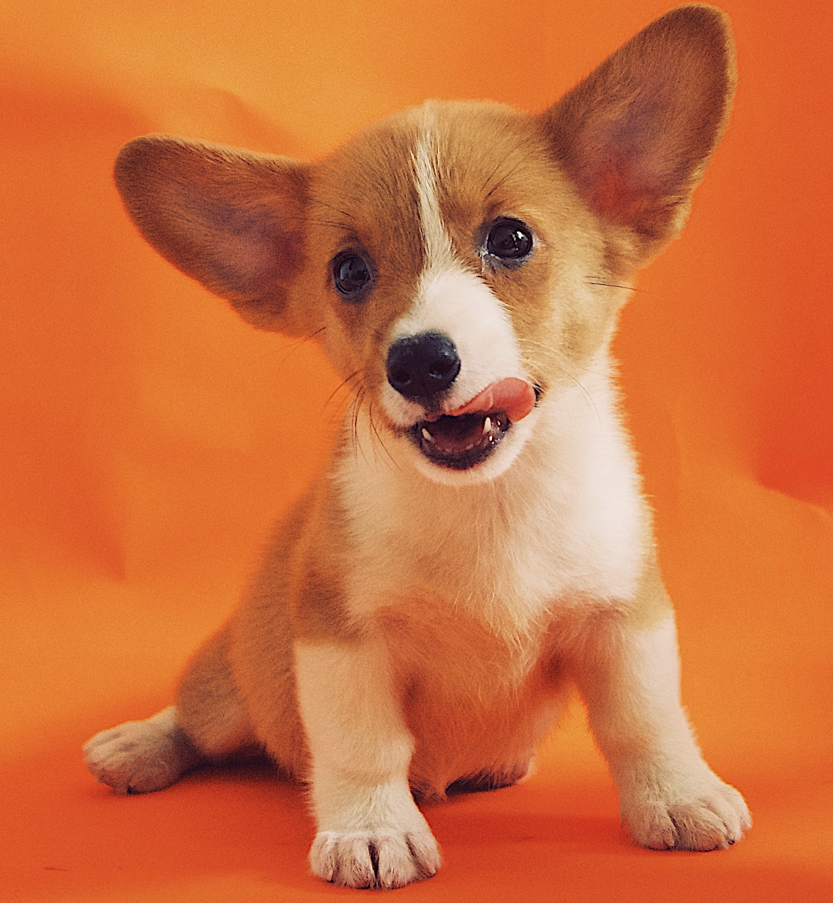

# Fine-Tune Stable Diffusion For Image-to-Image Generation

### Author: Soumit Das  
### Language: Python  
### Tool: Hugging Face, DreamBooth  
### Model: `CompVis/stable-diffusion-v1-4`  
### Dataset: [diffusers/dog-example](https://huggingface.co/datasets/diffusers/dog-example)  

---

### **1. Logging into Hugging Face**

To access Hugging Face resources, authenticate using the following method:

- **Command Line Login:**  
  Use the command `huggingface-cli login` and provide your API key when prompted.

---

### **2. Loading the Dataset**

To load the dataset, run the following code:

```python
from huggingface_hub import snapshot_download

local_dir = "./dog"
snapshot_download(
    "diffusers/dog-example",
    local_dir=local_dir, repo_type="dataset",
    ignore_patterns=".gitattributes",
)
```

The dataset will be downloaded in the `./dog` directory. After the download, a `.cache` folder will be created inside `./dog`. You need to **delete this folder** to avoid issues.

---

### **3. Installing Diffusers**

To avoid potential errors, install the diffusers library using the following steps:

1. Clone the Diffusers repository:

   ```bash
   git clone https://github.com/huggingface/diffusers
   cd diffusers
   ```

2. Install the diffusers package:

   ```bash
   pip install -e .
   ```

3. Navigate to the `examples/dreambooth` directory and install the required dependencies:

   ```bash
   cd diffusers/examples/dreambooth
   pip install -r requirements.txt
   ```

4. Install additional dependencies from the project's `requirements.txt`:

   ```bash
   pip install -r requirements.txt
   ```

---

### **4. Setting Up Environment Variables**

In the command prompt, set the following environment variables:

```bash
export MODEL_NAME="CompVis/stable-diffusion-v1-4"
export INSTANCE_DIR="dog"  # This is the data directory for finetuning. It should contain high-quality images of dogs.
export CLASS_DIR="clsdir"  # This directory will contain images generated using the base model for finetuning.
export OUTPUT_DIR="FinetunedStableDiffusion"  # This is the directory where the finetuned model will be saved.
```

- The `INSTANCE_DIR` should contain images of dogs, with no other prominent objects.
- The `CLASS_DIR` will contain generated images, simulating similar conditions to those of the instance images.

---

### **5. Downloading DreamBooth Script for Fine-Tuning**

Download the DreamBooth fine-tuning script provided by Hugging Face:  
[train_dreambooth.py](https://github.com/huggingface/diffusers/blob/main/examples/dreambooth/train_dreambooth.py)

---

### **6. Running the Fine-Tuning Command**

Execute the following command to fine-tune the model:

```bash
accelerate launch train_dreambooth.py \
  --pretrained_model_name_or_path=$MODEL_NAME  \
  --instance_data_dir=$INSTANCE_DIR \
  --class_data_dir=$CLASS_DIR \
  --output_dir=$OUTPUT_DIR \
  --with_prior_preservation --prior_loss_weight=1.0 \
  --instance_prompt="a photo of sks dog" \
  --class_prompt="a photo of dog" \
  --resolution=512 \
  --train_batch_size=1 \
  --gradient_accumulation_steps=2 --gradient_checkpointing \
  --use_8bit_adam \
  --learning_rate=5e-6 \
  --lr_scheduler="constant" \
  --lr_warmup_steps=0 \
  --num_class_images=200 \
  --max_train_steps=100 \
  --push_to_hub
```

**Explanation of Parameters:**

- `--pretrained_model_name_or_path`: Specifies the base model to fine-tune.
- `--instance_data_dir`: Directory containing the instance data (dog images).
- `--class_data_dir`: Directory for the class images (generated dog images).
- `--output_dir`: Directory to save the fine-tuned model.
- `--with_prior_preservation --prior_loss_weight`: Ensures the model preserves general features while learning the instance-specific features.
- `--instance_prompt`: The prompt for the model to generate images for the instance.
- `--class_prompt`: The prompt for the model to generate images for the class.
- `--resolution`: Sets the resolution of the input images.
- `--train_batch_size`: The batch size for training.
- `--gradient_accumulation_steps`: Number of steps before updating the model weights.
- `--gradient_checkpointing`: Saves memory during training.
- `--use_8bit_adam`: Uses 8-bit Adam optimizer for memory efficiency.
- `--learning_rate`: The learning rate for training.
- `--lr_scheduler`: Learning rate scheduling strategy.
- `--lr_warmup_steps`: Number of warmup steps for learning rate.
- `--num_class_images`: Number of class images used for training.
- `--max_train_steps`: Number of training steps (set to 100 for quick testing, recommended minimum 1000 for better results).
- `--push_to_hub`: Pushes the fine-tuned model to Hugging Face Hub.

---

### **7. Training Completion**

After running the training, the model will be fine-tuned. For better results, train for **at least 1000 steps** instead of 100. Once training is complete, you will use the fine-tuned model for inference.

---

### **8. Inference Using the Fine-Tuned Model**

The code for inference is available in the [notebook.ipynb](#) file. To use the fine-tuned model, follow these steps:

1. **Loading the Pre-Trained Model:**

   ```python
   import torch
   from diffusers import AutoPipelineForImage2Image
   from diffusers.utils import load_image, make_image_grid

   # Loading the pre-trained image-to-image model from the specified checkpoint
   pipeline = AutoPipelineForImage2Image.from_pretrained(
       "FinetunedStableDiffusion",
       torch_dtype=torch.float16,
       use_safetensors=True
   )

   # Enabling CPU offloading to reduce memory usage on the GPU
   pipeline.enable_model_cpu_offload()

   # Enabling memory-efficient attention (xFormers) to optimize memory usage during model inference
   pipeline.enable_xformers_memory_efficient_attention()
   ```

2. **Loading the Initial Image:**

   ```python
   # Loading the initial image
   init_image = load_image("dog/alvan-nee-9M0tSjb-cpA-unsplash.jpeg")
   ```

3. **Defining the Prompt and Generating the Image:**

   ```python
   # Defining the prompt
   prompt = "A photo of sks dog in a bucket"

   # Generating the new image
   image = pipeline(prompt, image=init_image).images[0]
   ```

4. **Creating and Saving the Image Grid:**

   ```python
   # Creating an image grid
   image_grid = make_image_grid([init_image, image], rows=1, cols=2)

   # Saving the generated image and image grid
   image.save("generated_dog-bucket.png")
   image_grid.save("Given_image_vs_Generated_Image.png")
   ```

---

### **9. Final Results**

Here is the input image:



Here is the generated image:


And here is the input vs. generated image comparison:


**The generated image is terrific** because we have run the training for only **100 steps**. Now, we are running it for **1000 steps**. After the run is completed, we will upload the newly generated image.

---

### **10. Conclusion**

Once the model is trained for a longer duration (1000 steps), the image generation should improve significantly. You can continue experimenting with different prompts, models, and settings to refine the image generation process.